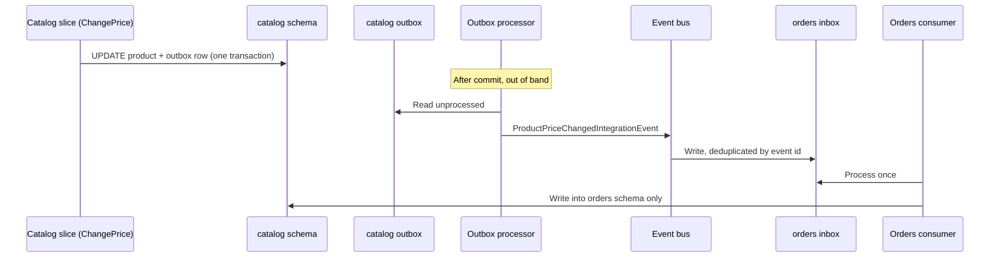
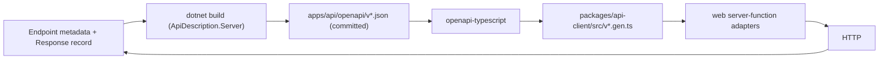

# Architecture: TanStack Start + .NET Modular Monolith (Vertical Slices)

This document is the normative architecture for the repository. Every rule pack, skill, agent, and command in this framework derives from it; when any artifact conflicts with this document, this document wins. Follow it when adding or changing code, and prefer the smallest change that preserves these boundaries.

Domain examples use a reference catalog/orders vocabulary (`Catalog`, `Orders`, products). They are examples of shape, not required product concepts.

## Fixed Stack

Web:

- `pnpm` workspaces + Turborepo 2
- Node.js 24 LTS (tooling and the TanStack Start server runtime)
- React 19 + TanStack Start 1 + TanStack Router + TanStack Query
- Tailwind CSS 4 + `shadcn` components
- `openapi-fetch` over generated types from `packages/api-client` (`openapi-typescript`)
- Vitest + Testing Library for tests

API:

- .NET 10 LTS, ASP.NET Core Minimal APIs
- Modular monolith: one assembly per business module, vertical slices inside each module
- EF Core 10 + PostgreSQL (Npgsql), one schema and one `DbContext` per module
- FluentValidation, `Scrutor` assembly scanning, `HybridCache`
- `Microsoft.AspNetCore.OpenApi` (native OpenAPI 3.1) + `Microsoft.Extensions.ApiDescription.Server` for build-time document generation + `Scalar.AspNetCore` for the reference UI
- `Microsoft.Extensions.Diagnostics.HealthChecks`, built-in rate limiting, OpenTelemetry
- xUnit + Shouldly + NSubstitute + NetArchTest + Testcontainers.PostgreSql for tests

Version pinning surfaces: `global.json` (the .NET SDK), `packageManager` in the root `package.json` (pnpm), `Directory.Packages.props` (central NuGet versions), `.config/dotnet-tools.json` (`dotnet-ef`), `pnpm-lock.yaml`.

`apps/web` and `apps/api` are separate deployables. Only `apps/api` reaches PostgreSQL. The web app communicates with the API over HTTP, server-to-server: locally the web dev server listens on port `3000` and the API on port `5000` (from `launchSettings.json`), and the API base URL is a server-only web setting.

Do not introduce tools, libraries, or patterns absent from this stack. Where this document is silent, say so and record an ADR rather than inventing policy.

### Two toolchains, one pipeline

The repository is a pnpm workspace that also contains a .NET solution. Turborepo is the single entry point for both.

- `apps/api` is a normal Turborepo package: a `package.json` whose scripts shell out to `dotnet`. Turbo owns task ordering, filtering, and caching; MSBuild owns compilation.
- The two languages meet at exactly one place: the OpenAPI documents that `apps/api` emits at build time and that `packages/api-client` turns into TypeScript. There is no other shared artifact and no shared runtime.
- TypeScript packages are consumed as source and bundled by Vite. There is no Node type-stripping runtime here, so relative imports are written without file extensions.
- Turborepo earns its place through that one edge: `@repo/api#build → @repo/api-client#generate → web typecheck and build` is ordering that `pnpm` scripts cannot express and CI would otherwise encode as a fragile script sequence.

## Non-Negotiable Rules

1. Organize UI code by product feature and API code by business module; inside a module, organize by vertical slice — one file per use case.
2. Keep TanStack route files and ASP.NET endpoints thin. Business rules belong in slice handlers and entities.
3. A module owns its PostgreSQL schema and its `DbContext`, and is the only code allowed to query them.
4. Modules communicate synchronously only through `{Module}.Contracts` public APIs and asynchronously through outbox/inbox integration events; never through HTTP loopback, another module's handler, `DbContext`, tables, or raw SQL.
5. A slice never calls another slice's handler. Duplicate the code, push the rule onto the entity, or publish an event.
6. The web app never reads C# source. TypeScript DTOs come only from `packages/api-client`, generated from the API's OpenAPI documents, and generated files are never hand-edited.
7. The committed OpenAPI documents and generated client are build outputs verified in CI. A drifted contract fails the build.
8. HTTP request and response shapes are transport contracts, not EF Core entities, commands, or domain types.
9. Every public endpoint declares its route, group name, operation id, tags, and every success and error response it can return.
10. Colocate web tests as `<source-name>.test.ts`, or `.test.tsx` when the test contains JSX. API tests live in test projects that mirror `Features/` slice by slice.
11. `packages/*` and `Common.*` contain only application-neutral, cross-cutting code. Feature and module business logic never moves there.
12. Enforce boundaries mechanically: ESLint boundaries on the web, `internal` visibility plus architecture tests on the API. Folder convention alone is not enforcement.
13. Read configuration only through validated, strongly typed options (`ValidateOnStart`) on the API and the validated config module on the web. No environment-name branching in business code.
14. Handlers signal failure with `Result`; endpoints map it to HTTP through one shared function; the global exception handler is the last resort and never returns internal details for a 5xx.
15. Both deployables shut down gracefully and expose liveness and readiness endpoints that are excluded from the public OpenAPI documents.
16. Never expose the internal API base URL, service credentials, tokens, or database errors to browser code.

## Workspace Layout

```text
.
├── apps/
│   ├── web/
│   │   ├── src/
│   │   │   ├── routes/                          # URL wiring only
│   │   │   ├── features/
│   │   │   │   └── catalog/
│   │   │   │       ├── components/
│   │   │   │       │   ├── product-list.tsx
│   │   │   │       │   └── product-list.test.tsx
│   │   │   │       ├── queries/
│   │   │   │       │   ├── products.queries.ts
│   │   │   │       │   └── products.queries.test.ts
│   │   │   │       ├── hooks/
│   │   │   │       ├── server/                  # TanStack server functions; HTTP adapters only
│   │   │   │       ├── types.ts                 # UI-only state/types
│   │   │   │       └── index.ts                 # feature public API
│   │   │   ├── components/                      # cross-feature app composition
│   │   │   ├── lib/                             # app-wide, feature-neutral adapters
│   │   │   ├── styles/
│   │   │   └── router.tsx
│   │   ├── components.json
│   │   └── vite.config.ts
│   └── api/
│       ├── package.json                         # Turborepo wrapper: dotnet scripts only
│       ├── Api.slnx
│       ├── Directory.Build.props                # net10.0, nullable, analyzers, warnings as errors
│       ├── Directory.Packages.props             # central NuGet versions
│       ├── openapi/                             # generated at build, committed, drift-checked
│       │   ├── v1.json
│       │   └── v2.json
│       ├── src/
│       │   ├── Common/
│       │   │   ├── Common.SharedKernel/         # Entity, Result, Error, ErrorType, IDateTimeProvider
│       │   │   ├── Common.Application/          # ICommand/IQuery, handler contracts, decorators, IEventBus
│       │   │   ├── Common.Infrastructure/       # DbContext conventions, outbox/inbox, auth, cache, telemetry
│       │   │   └── Common.Presentation/         # IEndpoint, discovery, CustomResults, Tags, ApiVersions
│       │   ├── Modules/
│       │   │   ├── Catalog/
│       │   │   │   ├── Catalog.Contracts/       # public: ICatalogApi, ProductSummary, integration events
│       │   │   │   └── Catalog/                 # everything internal
│       │   │   │       ├── Features/Products/
│       │   │   │       │   ├── GetProduct.cs    # Query + Response + Handler + Endpoint
│       │   │   │       │   ├── CreateProduct.cs
│       │   │   │       │   ├── Product.cs
│       │   │   │       │   ├── ProductErrors.cs
│       │   │   │       │   └── ProductCacheKeys.cs
│       │   │   │       ├── Database/            # CatalogDbContext, configurations, migrations
│       │   │   │       ├── PublicApi/           # ICatalogApi implementation
│       │   │   │       └── CatalogModule.cs     # AddCatalogModule + MapCatalogEndpoints
│       │   │   └── Orders/
│       │   │       ├── Orders.Contracts/
│       │   │       └── Orders/
│       │   └── Api/
│       │       ├── Program.cs                   # composition root, pipeline, module list
│       │       └── Extensions/
│       └── tests/
│           ├── Modules/Catalog/Catalog.UnitTests/
│           ├── Modules/Orders/Orders.UnitTests/
│           ├── ArchitectureTests/               # module isolation + slice isolation
│           └── IntegrationTests/                # real host + Testcontainers PostgreSQL
├── packages/
│   ├── api-client/                              # generated from apps/api/openapi/*.json
│   │   └── src/
│   │       ├── v1.gen.ts                        # generated; never edited
│   │       ├── v2.gen.ts
│   │       ├── client.ts                        # typed fetch client factory
│   │       └── index.ts                         # curated DTO re-exports
│   ├── ui/                                      # shared shadcn primitives and tokens
│   ├── eslint-config/
│   └── typescript-config/
├── global.json                                  # pins the .NET SDK
├── turbo.json
├── package.json
└── pnpm-workspace.yaml
```

Generated files — `routeTree.gen.ts`, `*.gen.ts`, EF Core migrations, `openapi/*.json` — do not need tests and are never edited by hand.

## Dependency Direction

```text
apps/web/routes -> web feature public APIs -> feature components/queries/server adapters
web server adapters -> packages/api-client -> HTTP -> apps/api endpoints
apps/api endpoint -> slice handler -> module DbContext -> module PostgreSQL schema
module slice -> another module's Contracts assembly -> that module's public API implementation
apps/web -> packages/ui
packages/api-client -> apps/api/openapi/*.json (build artifact only)
```

Forbidden directions:

- `packages/*` -> `apps/*` source
- `apps/web` -> C# source, connection strings, or the database
- endpoint -> `DbContext` (the handler owns data access)
- slice -> another slice's `Command`, `Query`, `Handler`, `Validator`, or `Endpoint`
- module -> another module's implementation assembly, entities, `DbContext`, schema, or error catalogue
- `{Module}.Contracts` -> anything except `Common.SharedKernel`
- `Api` host -> any module type other than `Add{Module}Module` and `Map{Module}Endpoints`
- `Common.*` -> any module namespace
- hand-written TypeScript DTO -> duplicating a schema that `packages/api-client` already generates

## Web Application

### Feature ownership

Each folder under `apps/web/src/features/<feature>` owns its UI, query definitions, mutations, server-function HTTP adapters, and UI-only types.

- Feature internals use relative imports. External consumers import only `@/features/<feature>`.
- Sibling features are composed in routes or app-level components. A direct sibling dependency may use only that feature's public barrel.
- `routes/**` validates URL state, prefetches queries, and renders feature entry points. It contains no business or fetch logic.
- `packages/ui` holds generic shadcn primitives. Feature-specific compositions stay in the feature.
- Web features and API modules do not have to be one-to-one. A screen may compose two modules; name the folder after the product concept.

### API access and TanStack Query

The default data path is:

```text
route loader -> ensureQueryData(queryOptions) -> createServerFn adapter
-> ASP.NET endpoint -> slice handler -> module DbContext -> PostgreSQL
```

- TanStack server functions are backend-for-frontend adapters only. They call the API with the server-only base URL, attach credentials, parse the documented response, and map transport errors. They contain no business logic and never touch the database.
- Adapters call the API through the generated `openapi-fetch` client, so a renamed path or changed payload is a TypeScript error rather than a runtime 404.
- Every outbound call sets an explicit timeout and passes the request's `AbortSignal`. A stalled API call must not pin an SSR render open until the platform kills it. Retry only idempotent reads.
- Forward the incoming `traceparent` and `x-request-id` so a server-function call and its API request share one correlation id. Map API failures to typed errors carrying a status and a safe message; never forward an upstream `ProblemDetails` body straight to the browser.
- Query factories are shared by route loaders and components so SSR prefetch and hydration use the same key and function.
- Create one `QueryClient` per SSR request and install the TanStack Router SSR Query integration.
- Components read with `useSuspenseQuery`. Mutation hooks use `useServerFn`, then invalidate the narrowest affected query keys.
- Query keys include the resource, identifier, and normalized filters. No ad hoc string keys in components.
- The browser never learns the API base URL; it calls the server-function RPC stub.

```ts
// apps/web/src/features/catalog/server/get-product.ts
import { createServerFn } from '@tanstack/react-start';
import { apiClient } from '@/lib/api-client';

export const getProduct = createServerFn({ method: 'GET' })
  .validator((id: string) => id)
  .handler(async ({ data: id, signal }) => {
    const { data, error, response } = await apiClient.GET(
      '/api/v1/catalog/products/{id}',
      { params: { path: { id } }, signal },
    );

    if (error) {
      throw toApiError(response.status, error);
    }

    return data;
  });
```

### Authentication across the boundary

- The browser holds an httpOnly, `SameSite` session cookie issued by the web app. It never holds an API bearer token.
- Server functions exchange or forward that session for the API credential on every call. The credential lives only in server memory and configuration.
- The API validates the token itself on every protected endpoint. A TanStack Router `beforeLoad` guard is a UX affordance, not an authorization boundary.
- Server functions are POST RPC endpoints. Keep cookies `SameSite=Lax` or stricter and verify the request origin; a UI guard does not protect a mutation.

## .NET API

The API is a modular monolith organized by vertical slices. Between modules: a module owns its data and exposes a contract; nothing outside may name anything else it contains. Inside a module: maximize coupling within a slice, minimize coupling between slices.

### Module shape

Each module is two projects — `{Module}` (everything `internal`) and `{Module}.Contracts` (its only public surface) — and exposes exactly two public members to the host:

```csharp
builder.Services
    .AddCommonInfrastructure(builder.Configuration)
    .AddCatalogModule(builder.Configuration)
    .AddOrdersModule(builder.Configuration);

WebApplication app = builder.Build();

app.MapCatalogEndpoints();
app.MapOrdersEndpoints();
```

Modules are listed explicitly, in dependency order, because a new module is an ownership decision rather than a routine change. Two projects rather than folders in one: `internal` is enforced by the compiler at the assembly boundary and by nothing at the folder boundary; making a module its own assembly converts every cross-module isolation rule from an architecture test into a build error.

Do not split a module into Domain/Application/Infrastructure/Presentation layers. A slice is already the unit; layers reintroduce the indirection vertical slices exist to remove.

#### Registration

Each module scans its own assembly for handlers, validators, and endpoints, and calls `services.Decorate` over its own registrations. A host-level scan would make every module's handlers resolvable from one container and defeat the boundary at runtime; a host-level `Decorate` is an ordering bug that silently undecorates whichever module registers last.

```csharp
namespace Catalog;

public static class CatalogModule
{
    public static IServiceCollection AddCatalogModule(this IServiceCollection services, IConfiguration configuration)
    {
        services.AddDbContext<CatalogDbContext>(options => options
            .UseNpgsql(
                configuration.GetConnectionString("Database"),
                npgsql => npgsql
                    .MigrationsHistoryTable(HistoryRepository.DefaultTableName, Schemas.Catalog)
                    .MigrationsAssembly(typeof(CatalogDbContext).Assembly.FullName))
            .UseSnakeCaseNamingConvention());

        Assembly assembly = typeof(CatalogModule).Assembly;

        services.Scan(scan => scan.FromAssemblies(assembly)
            .AddClasses(c => c.AssignableTo(typeof(ICommandHandler<>)), publicOnly: false)
                .AsImplementedInterfaces().WithScopedLifetime()
            .AddClasses(c => c.AssignableTo(typeof(ICommandHandler<,>)), publicOnly: false)
                .AsImplementedInterfaces().WithScopedLifetime()
            .AddClasses(c => c.AssignableTo(typeof(IQueryHandler<,>)), publicOnly: false)
                .AsImplementedInterfaces().WithScopedLifetime());

        services.Decorate(typeof(ICommandHandler<,>), typeof(ValidationDecorator.CommandHandler<,>));
        services.Decorate(typeof(ICommandHandler<,>), typeof(LoggingDecorator.CommandHandler<,>));

        services.AddValidatorsFromAssembly(assembly, includeInternalTypes: true);
        services.AddEndpoints(assembly);

        services.AddScoped<ICatalogApi, CatalogApi>();

        return services;
    }

    public static IEndpointRouteBuilder MapCatalogEndpoints(this IEndpointRouteBuilder app)
    {
        RouteGroupBuilder v1 = app.MapGroup("api/v1/catalog")
            .WithTags(Tags.Catalog)
            .WithGroupName(ApiVersions.V1);

        v1.MapEndpoints(ApiVersions.V1);

        return app;
    }
}
```

`Map{Module}Endpoints` owns the module's route prefix and one route group per active version. The group applies the prefix, the module tag, and the OpenAPI group name, so an individual endpoint cannot forget them; `MapEndpoints(version)` maps only the `IEndpoint` implementations whose `Version` matches.

Handlers, validators, and endpoints nested in an `internal static class` are not public, so the scan uses `publicOnly: false` and `AddValidatorsFromAssembly(..., includeInternalTypes: true)`.

#### Contracts — the only public surface

```csharp
namespace Catalog.Contracts;

public interface ICatalogApi
{
    Task<ProductSummary?> GetAsync(Guid productId, CancellationToken cancellationToken = default);

    Task<IReadOnlyDictionary<Guid, ProductSummary>> GetManyAsync(
        IReadOnlyCollection<Guid> productIds,
        CancellationToken cancellationToken = default);
}

public sealed record ProductSummary(Guid Id, string Name, int PriceCents);
```

```csharp
namespace Catalog.Contracts.IntegrationEvents;

public sealed class ProductPriceChangedIntegrationEvent(Guid productId, int priceCents) : IntegrationEvent
{
    public Guid ProductId { get; init; } = productId;
    public int PriceCents { get; init; } = priceCents;
}
```

No entity, no `DbSet`, no EF Core type, no error catalogue. `ProductSummary` is purpose-built, so adding a column to `catalog.products` cannot ripple into `Orders`. Keep the contract small: a contract that grows one method per consumer question is a query API onto someone else's database. When a consumer wants five fields it does not act on, the answer is usually an integration event and a local copy, not a wider contract.

Integration events are versioned public data. Once a consumer deserializes one, renaming a property is a breaking change with no compiler error at the consumer. Add properties; never repurpose them.

#### PublicApi — the contract implementation

```csharp
namespace Catalog.PublicApi;

internal sealed class CatalogApi(IQueryHandler<GetProduct.Query, GetProduct.Response> handler) : ICatalogApi
{
    public async Task<ProductSummary?> GetAsync(Guid productId, CancellationToken cancellationToken = default)
    {
        Result<GetProduct.Response> result = await handler.Handle(new GetProduct.Query(productId), cancellationToken);

        return result.IsSuccess
            ? new ProductSummary(result.Value.Id, result.Value.Name, result.Value.PriceCents)
            : null;
    }
}
```

It goes through the module's own slice rather than straight to the `DbContext`; a contract implementation that queries the context directly is a second, undocumented read path with different caching and authorization behavior. Returning `null` rather than `Result` keeps the module's error vocabulary private — a consumer that switches on another module's error codes is coupled to them.

### Messaging abstractions

Two interface pairs and `Result` are enough; no mediator library. Endpoints inject `ICommandHandler<...>`/`IQueryHandler<...>` rather than the concrete handler, so decorators can wrap the registration.

```csharp
public interface ICommand;
public interface ICommand<TResponse>;
public interface IQuery<TResponse>;

public interface ICommandHandler<in TCommand> where TCommand : ICommand
{
    Task<Result> Handle(TCommand command, CancellationToken cancellationToken);
}

public interface ICommandHandler<in TCommand, TResponse> where TCommand : ICommand<TResponse>
{
    Task<Result<TResponse>> Handle(TCommand command, CancellationToken cancellationToken);
}

public interface IQueryHandler<in TQuery, TResponse> where TQuery : IQuery<TResponse>
{
    Task<Result<TResponse>> Handle(TQuery query, CancellationToken cancellationToken);
}
```

Decorators are the one place where cross-cutting behavior is invisible from the slice. Keep the set small — validation and logging apply uniformly; transactions, retries, and caching do not, and hiding them globally makes the wrong default invisible.

### Anatomy of a slice

One use case is one file holding one `internal static class` with nested types: `Command`/`Query`, `Response`, `Validator` (commands), `Handler`, and the `Endpoint`. The endpoint owns the wire shape and the OpenAPI metadata; the handler owns the rules.

```csharp
namespace Catalog.Features.Products;

internal static class GetProduct
{
    internal sealed record Query(Guid ProductId) : IQuery<Response>;

    internal sealed record Response(Guid Id, string Name, int PriceCents);

    internal sealed class Handler(CatalogDbContext context) : IQueryHandler<Query, Response>
    {
        public async Task<Result<Response>> Handle(Query query, CancellationToken cancellationToken)
        {
            Response? product = await context.Products
                .Where(p => p.Id == query.ProductId)
                .Select(p => new Response(p.Id, p.Name, p.PriceCents))
                .SingleOrDefaultAsync(cancellationToken);

            return product is null
                ? Result.Failure<Response>(ProductErrors.NotFound(query.ProductId))
                : product;
        }
    }

    internal sealed class Endpoint : IEndpoint
    {
        public string Version => ApiVersions.V1;

        public void MapEndpoint(IEndpointRouteBuilder app) =>
            app.MapGet("products/{id:guid}", async (
                Guid id,
                IQueryHandler<Query, Response> handler,
                CancellationToken cancellationToken) =>
            {
                Result<Response> result = await handler.Handle(new Query(id), cancellationToken);

                return result.Match(TypedResults.Ok, CustomResults.Problem);
            })
            .WithName("getCatalogProductV1")
            .WithSummary("Get a catalog product")
            .Produces<Response>(StatusCodes.Status200OK)
            .ProducesProblem(StatusCodes.Status401Unauthorized)
            .ProducesProblem(StatusCodes.Status404NotFound)
            .RequireAuthorization();
    }
}
```

- Routes are relative because the module maps its endpoints into its own versioned route group.
- `Response` is the transport contract for this operation and the type the generated TypeScript is derived from; it is never an entity and never an EF Core projection that leaks a navigation property.
- The whole static class is `internal`; nothing in it is another module's business.
- Ownership is part of the query (`... && p.OwnerId == userContext.UserId` where applicable), not a separate check. A missing row and a row owned by someone else both produce the same 404.
- Derive the owner from `IUserContext` inside the handler; never accept it from the request.
- One command, one module, one `SaveChangesAsync`, one consistency boundary. Assign identifiers before raising domain events (client-generated `Guid`), or the event carries `Guid.Empty`.
- Raise domain events on the entity when something else reacts; invalidate affected cache keys after a successful save.
- Validators check input shape ("name is required"); handlers and entities check business rules ("a completed order cannot be completed twice").
- When a slice exceeds ~150 lines, extract behavior to the entity — not to a service, and not to another slice.

Three kinds of checks live in three places:

| Check                | Example                                 | Where              |
| -------------------- | --------------------------------------- | ------------------ |
| Domain rule          | An archived product cannot change price | Entity             |
| Use-case validation  | Name is required, price is non-negative | `Validator`        |
| Transport validation | Body parses, route id is a `Guid`       | Endpoint / binding |

### PostgreSQL ownership

- One database, one schema per module via `modelBuilder.HasDefaultSchema(Schemas.Catalog)`, one `internal sealed` `DbContext` per module with its own migrations history table.
- No cross-schema foreign keys and no cross-schema joins, including in raw SQL. External identifiers are plain `uuid` columns.
- Snapshot what you need: an order line that must display the product name at purchase time stores it; it does not join.
- Entities are configured in `IEntityTypeConfiguration<T>` classes under `Database/`; queries project to the slice's `Response`; `AsNoTracking` for read-only entity queries; `IQueryable` never crosses into an HTTP contract.
- Uniqueness, foreign keys (within the schema), and concurrency are enforced in the database, not only in code.
- Migrations are generated per module and applied as a reviewed, gated deployment step, never automatically at startup:

  ```bash
  pnpm --filter @repo/api exec dotnet ef migrations add AddProductSlugIndex \
    --project src/Modules/Catalog/Catalog \
    --startup-project src/Api \
    --context CatalogDbContext
  ```

- A shared connection string is compile-time isolation only. Use per-module PostgreSQL roles when the database itself must reject cross-schema access; architecture tests cannot see through a SQL string literal.

### Cross-module communication

#### Synchronous, through the contract

A slice that needs another module's data injects that module's Contracts interface — an ordinary in-process interface resolved through DI, not an HTTP call back into the same application. A module must not call a sibling's HTTP route, must not use `HttpClient` against its own host, and must not reuse the generated TypeScript client as an internal contract. HTTP is for talking to other deployables.

This is a synchronous in-process dependency: if `Catalog` fails, the calling `Orders` slice fails. Often the cheapest cross-module call is the one you delete — a token that already proves a user exists makes an existence check redundant.

#### Composing cross-module reads

Choose the read shape from the requirement. A cross-schema join is not a read-side shortcut.

| Requirement                                        | Required implementation                                                                                 |
| -------------------------------------------------- | ------------------------------------------------------------------------------------------------------- |
| One record with current sibling-owned details      | Load local data, call the sibling's Contracts API once, compose the response in the query handler       |
| A page enriched with sibling-owned details         | Page by local fields, deduplicate external ids, call one purpose-built batch API, join in memory        |
| Sort, filter, or page by a sibling-owned field     | Maintain an event-fed projection in the consuming module's schema and query only that local table       |
| A historical value such as the price at order time | Snapshot the value into the consuming module during the write; do not update it when the source changes |
| A dashboard spanning several modules               | Give a reporting module its own event-fed projection; do not query operational schemas together         |

The owning module implements the batch API with one `WHERE Id IN (...)` query; never one call per row. The consuming slice issues one local query plus one batch call per page and joins in memory. A missing summary stays `null` in the read model unless the use case requires the whole request to fail.

Event-fed projections are deliberately eventually consistent: publish through the module's outbox, consume through the consumer's inbox keyed by event id, and write only into the consuming module's schema.

#### Asynchronous, through integration events

The reliable shape has three parts; skipping any one produces a system that works in testing and loses events under load:

1. A domain event raised in a slice is captured into the **module's outbox** table in the same transaction as the state change — a `SaveChanges` interceptor does this, so no slice can forget.
2. A background processor reads unprocessed outbox rows, invokes the module's domain-event handlers, and publishes the resulting integration event.
3. Consuming modules write the event to their own **inbox**, keyed by event id, and process it once.



The outbox makes publication atomic with the write; the inbox makes consumption idempotent, because at-least-once is the only guarantee any bus gives. The consumer lives in the module that **reacts**, next to the feature that cares — `Orders/Features/Orders/OnProductPriceChanged.cs`.

#### Choosing between them

| Situation                                          | Mechanism                                    |
| -------------------------------------------------- | -------------------------------------------- |
| The slice needs data to make a decision            | Contract interface                           |
| The slice must fail if the other module fails      | Contract interface                           |
| Another module reacts to something that happened   | Integration event                            |
| The reaction may be delayed, retried, or reordered | Integration event                            |
| Two modules must change together atomically        | Neither — the boundary is in the wrong place |

If most slices in one module need a transaction spanning another, those are one module split along the wrong seam.

#### Transactions across modules

Inside a module: one command, one `SaveChangesAsync`. Across modules the guarantee is gone by construction; any cross-module write workflow explicitly chooses one of these and records the choice in an ADR:

| Option                | How it works                                                                       | Cost                                                                                  |
| --------------------- | ---------------------------------------------------------------------------------- | ------------------------------------------------------------------------------------- |
| Share one transaction | Both contexts enlist in one `DbTransaction` over one connection                    | Atomic and cheap today; precisely the coupling that vanishes on extraction            |
| Compensating action   | The contract exposes an inverse operation, invoked when the caller's work fails    | Not crash-safe; needs durable, idempotent operation identities to be more than a demo |
| Reserve-then-confirm  | Model the dependency as an expiring reservation row; a sweeper releases stale ones | Most work, and the only option correct across a crash that survives extraction        |

### Shared code

| Scope               | Holds                                                                  | Bar                                                             |
| ------------------- | ---------------------------------------------------------------------- | --------------------------------------------------------------- |
| `Common.*`          | `Result`, `Entity`, messaging contracts, `IEndpoint`, outbox, auth     | Stable, cross-cutting, no business meaning, no module reference |
| A module's own root | Its entities, error catalogue, cache keys, `DbContext`, configurations | Used by more than one slice **in that module**                  |
| A slice             | Everything else                                                        | Duplication between slices is fine and often correct            |

Extract on the second occurrence of the _rule_, not of the _code_, and prefer pushing behavior onto the entity over creating a service. A `Common.Domain` project holding shared entities is not a shared kernel — it is the single domain model the modules were supposed to replace. If two modules need the same concept, each models what it needs of it. The failure signal: a change to a `Common` type forces edits in unrelated modules.

### Enforcing the boundary

`internal` does most of the work; three gaps remain, closed by NetArchTest architecture tests:

1. **The project reference itself.** Nothing stops someone adding `Catalog` as a reference to `Orders`. Assert each module has no dependency on any sibling implementation namespace.
2. **Slice isolation inside a module.** Assert handlers do not depend on other slices' nested types.
3. **Contract purity and the host.** Assert each Contracts assembly references no module, and `Api` names no module type beyond the two registration entry points.

Add convention rules — handlers and endpoints sealed, module types internal, `DbContext` types internal — so drift shows up in CI rather than in review. What no test can see: a cross-schema join written as a SQL string, and a foreign key added in a migration. Those need a review habit and, if it matters, per-module database roles.

### Configuration

Bind every setting to a typed options class, validated at startup:

```csharp
builder.Services
    .AddOptions<CatalogOptions>()
    .BindConfiguration(CatalogOptions.SectionName)
    .ValidateDataAnnotations()
    .ValidateOnStart();
```

- A missing or malformed setting fails the boot with a named error. No `IConfiguration["..."]` reads inside slices, and no `configuration.GetConnectionString(...)!`.
- Environment differences are values, not code paths. Add `Shutdown:DrainSeconds` or `RateLimit:PermitLimit` rather than branching on `IHostEnvironment.IsProduction()`. Environment checks are allowed only in `Program.cs`, for developer-only middleware such as the reference UI.
- Secrets arrive as environment variables or from a secret store, and are never committed, logged, or returned by an endpoint. Local development uses user secrets.
- The web app's config module owns the API base URL and service credential; they are server-only values and never reach a client bundle.

### Error handling

- Handlers return `Result`/`Result<T>` with a semantically correct `ErrorType`. They never build HTTP responses.
- Endpoints translate through the one shared `CustomResults.Problem` function so every failure has the same `ProblemDetails` shape.
- The `ErrorType` → status mapping is fixed: `Validation`/`Problem` → 400, `Unauthorized` → 401, `Forbidden` → 403, `NotFound` → 404, `Conflict` → 409, `Failure` → 500. Model every status the API promises — including `Unauthorized` and `Forbidden` — as an explicit `ErrorType`, or authorization failures fall through to a 500.
- Error catalogues (`ProductErrors`) are `internal`, per feature, in the owning module.
- `AddProblemDetails()` plus one `IExceptionHandler` is the safety net. It logs the exception with structured fields, returns the documented error contract, preserves 4xx messages, and replaces every 5xx message with a generic one. Stack traces, SQL, and Npgsql error codes never reach a client.
- The rate limiter's rejection, the authentication challenge, and any endpoint filter return the same content type and shape as the shared handler.

### Logging and correlation

- Log through `ILogger<T>` with structured fields, never interpolated strings.
- Derive the request correlation id from the inbound `x-request-id` when present; otherwise use the W3C trace id. Emit it on the response so a web-side error can be traced.
- Enable OpenTelemetry tracing for ASP.NET Core, `HttpClient`, and Npgsql; the web adapters propagate `traceparent`, so one trace spans both deployables.
- Redact `Authorization`, `Cookie`, and any password or secret field before logging. Sensitive-data logging in EF Core stays off outside local development.

### Security baseline

- Every protected endpoint calls `RequireAuthorization` with a real policy, and every handler enforces resource ownership itself from `IUserContext`. There is no layer above a slice to catch a miss.
- Token validation, the authentication scheme, and `IUserContext` live in `Common.Infrastructure`, configured once in the host. Permission definitions live in the module that owns them.
- Configure Kestrel limits explicitly: max request body size, request headers timeout, keep-alive timeout — sized against the proxy in front of the API.
- Enable `UseForwardedHeaders` only when the app really sits behind a proxy that rewrites `X-Forwarded-For`, and configure the known proxies.
- The built-in rate limiter is per-process. With more than one instance, apply the real limit at the gateway or back the limiter with a distributed store, and record which one is in use.
- Browser hardening belongs to the deployable that serves HTML: the CSP, frame options, and referrer policy are the web app's. The API sends `nosniff` and HSTS from one middleware in `Common.Presentation`.
- Register CORS only if a browser calls the API directly. The default path goes through server functions, which are server-to-server and need no CORS headers.
- Deny by default; consistent `401`/`403` payloads that do not reveal whether the resource exists.

### Caching

- Cache inside the query handler that owns the read, through `HybridCache`. `AddHybridCache()` alone is in-process; configure a distributed secondary store for more than one instance.
- Keep every key for a module in one `{Module}CacheKeys` class so read/write pairs are greppable. Scope keys to the module and to the user or tenant when the data is principal-specific — two modules caching `user-{id}` in one process will collide.
- Invalidate only after a successful save, never before. Cross-module invalidation lives in the consumer's own integration-event handler, next to the read it protects.
- Add an integration test per cached read that mutates through each write path — including the cross-module event path.

### Health, readiness and shutdown

```csharp
app.MapHealthChecks("/health/live", new HealthCheckOptions { Predicate = _ => false })
   .ExcludeFromDescription();

app.MapHealthChecks("/health/ready", new HealthCheckOptions
   {
       Predicate = check => check.Tags.Contains("ready")
   })
   .ExcludeFromDescription();
```

- Liveness does no I/O. Readiness checks the shutdown flag first, then the database, and returns 503 when either says the instance is unavailable.
- A hosted service registered in `Program.cs` stops before Kestrel: its `StopAsync` flips the readiness flag to false and waits `Shutdown:DrainSeconds` so the load balancer stops routing before in-flight requests are cut.
- `HostOptions.ShutdownTimeout` is the hard deadline covering the drain plus request completion. Size it above `Shutdown:DrainSeconds`, not equal to it.
- Both health routes are excluded from every public OpenAPI document, so they never appear in the generated client.

## HTTP Contracts

### OpenAPI is the source of truth

C# owns the contract. The OpenAPI documents are generated from the exact endpoint metadata and response types, and TypeScript is generated from those documents. Nothing is hand-written twice.



Because the generator only sees what the endpoint declares, every public endpoint must set:

- `WithName` — a unique, version-suffixed operation id; it becomes the generated client's operation name
- `WithGroupName` — the document/version the endpoint belongs to (applied by the module's route group)
- `WithTags` — the module tag, the only grouping the generator sees
- `WithSummary`, and `WithDescription` when the summary is not enough
- `Produces<T>` / `ProducesProblem` for every success and error status the endpoint can return
- security requirements when protected, and `deprecated` metadata when superseded

An endpoint that returns `Results.Ok(...)` without a declared response type generates an untyped schema and an `unknown` on the web side. Use `TypedResults` and declare the type.

Nested response types share a name — every slice calls its record `Response` — and the default schema reference id is the bare type name, so the documents degrade into `Response`, `Response2`, … and the generated TypeScript with them. Configure schema reference ids once, in `Common.Presentation`, to prefix a nested type with its declaring slice:

```csharp
options.CreateSchemaReferenceId = type =>
    type.Type.DeclaringType is { } slice
        ? $"{slice.Name}{type.Type.Name}"   // GetProduct.Response -> GetProductResponse
        : OpenApiOptions.CreateDefaultSchemaReferenceId(type);
```

This is what makes the stable re-export names in `packages/api-client` possible.

### Generated client package

- `packages/api-client/src/*.gen.ts` is produced by `openapi-typescript` from `apps/api/openapi/*.json` and is never edited. Lint rules and CODEOWNERS treat it as read-only.
- `client.ts` exports one `openapi-fetch` client factory that takes the base URL, timeout, credential attachment, and correlation-header hooks as arguments. The web app instantiates it in `lib/` from its validated server-only config; the package itself reads no configuration, keeping it application-neutral.
- `index.ts` re-exports the DTOs the web app uses under stable names — `export type ProductV1 = components['schemas']['GetProductResponse']` — so features never index into generated internals.
- The web app imports only `@repo/api-client`. Copying a generated type into a feature's `types.ts` is a boundary violation; `types.ts` is for UI-only state.

### Type mapping across the boundary

C# and TypeScript disagree in a few places that silently corrupt data. Decide these once, globally, in `Common.Presentation`:

| C#                          | JSON / TypeScript                  | Rule                                                                     |
| --------------------------- | ---------------------------------- | ------------------------------------------------------------------------ |
| `Guid`                      | `string` (`format: uuid`)          | Always; never expose integer surrogate keys                              |
| `decimal`                   | number — precision loss in JS      | Use integer minor units (`PriceCents`) or a documented string format     |
| `long` beyond 2^53          | number — precision loss in JS      | Serialize as `string` and document it                                    |
| `DateTimeOffset`            | `string` (`format: date-time`)     | UTC on the wire; `DateTime` without an offset is ambiguous               |
| `DateOnly` / `TimeOnly`     | `string` (`format: date` / `time`) | Preferred over encoding a date in a `DateTime`                           |
| `enum`                      | numeric by default                 | Register `JsonStringEnumConverter` so the client gets a string union     |
| non-nullable reference type | required property                  | Keep nullable reference types on; the schema's optionality depends on it |
| `null` vs absent            | `T \| null` vs optional key        | Pick one ignore condition globally and never override it per endpoint    |
| PascalCase property         | camelCase key                      | Keep the ASP.NET Core default policy; never customize per endpoint       |

Adding an enum member is a breaking change for a TypeScript client that switches exhaustively. Treat it as a versioned change.

### Endpoint versioning

- Major versions live in the URL: `/api/v1/...`, `/api/v2/...`. Do not mix URL, header, and query-parameter versioning.
- Each version is its own OpenAPI document (`AddOpenApi("v1")`, `AddOpenApi("v2")`) and its own generated TypeScript module. An endpoint without a group name is included in _every_ document — always set it through the module's route group.
- Version endpoints independently. A breaking change to one operation adds one contract and one route; it does not clone the module.
- When only the wire shape changed, add a second `Endpoint` nested type in the same slice, mapped into the v2 group, reusing the same handler. When the use case itself changed, add a new slice file beside the old one; the two slices share the entity's rules, not each other's handlers.
- Keep the old endpoint operational and tested while supported clients migrate. Mark the operation deprecated; when removal is scheduled, return `Deprecation`, `Sunset`, and successor `Link` headers.
- Do not mutate a released contract incompatibly. Removing or renaming a field, changing its meaning or type, making optional input required, changing status semantics, or changing the path requires a new major version.
- Backward-compatible additions may stay in the current version. Treat a new response field as breaking when a strict generated consumer cannot ignore it.
- Delete an old version only after telemetry confirms no supported client calls it and its deprecation window has ended. Deleting the endpoint and regenerating the client is one commit; a compile error on the web side is the expected way to find stragglers.

### OpenAPI documents and API reference UI

- `AddOpenApi(documentName)` per active version; `MapOpenApi()` serves `/openapi/{documentName}.json` at runtime.
- `Microsoft.Extensions.ApiDescription.Server` writes the same documents at build time into `OpenApiDocumentsDirectory`, set to `apps/api/openapi`. Those files are committed — they are the input to codegen and the reviewable diff of every contract change.
- `MapScalarApiReference()` serves the reference UI at `/docs`. It advertises the entire surface: protect it or disable it outside non-production environments, and exclude it from the public document.
- An API boot test asserts that every configured document generates, that operation ids are unique across documents, and that every public route appears exactly once in its own document.
- CI fails on an accidental breaking change to an active version's document.

## Task Orchestration

`apps/api/package.json` is a thin wrapper — no JavaScript, no build logic:

```json
{
  "name": "@repo/api",
  "private": true,
  "scripts": {
    "dev": "dotnet watch run --project src/Api",
    "build": "dotnet build Api.slnx -c Release",
    "test": "dotnet test Api.slnx -c Release --no-build",
    "lint": "dotnet format Api.slnx --verify-no-changes"
  }
}
```

`turbo.json` wires the codegen edge and keeps the .NET tasks honest about caching:

```json
{
  "$schema": "https://turbo.build/schema.json",
  "globalDependencies": ["global.json", ".config/dotnet-tools.json"],
  "tasks": {
    "@repo/api#build": {
      "cache": false,
      "outputs": ["openapi/*.json"]
    },
    "@repo/api#test": { "dependsOn": ["build"], "cache": false },
    "@repo/api-client#generate": {
      "dependsOn": ["@repo/api#build"],
      "inputs": ["$TURBO_ROOT$/apps/api/openapi/*.json"],
      "outputs": ["src/*.gen.ts"]
    },
    "@repo/web#build": {
      "dependsOn": ["^build", "@repo/api-client#generate"],
      "outputs": [".output/**", "dist/**"]
    },
    "typecheck": { "dependsOn": ["^build", "@repo/api-client#generate"] },
    "build": { "dependsOn": ["^build"], "outputs": ["dist/**", ".output/**"] },
    "dev": { "cache": false, "persistent": true }
  }
}
```

Four rules the caching and ordering depend on:

- Never put `bin/` or `obj/` in a shared Turborepo cache. They contain absolute paths and are not portable between machines. MSBuild is already incrementally correct, so `dotnet build` opts out of Turbo caching and only its `openapi/*.json` output is declared.
- Never cache a task whose real output is a database or a running process.
- `inputs` globs are package-relative. The codegen task reaches outside `packages/api-client`, so its input must use the `$TURBO_ROOT$` prefix; a `../../` glob is not hashed reliably.
- `@repo/web#build` declares the codegen dependency explicitly because `packages/api-client` is consumed as source and has no `build` script — `^build` alone would never order generation before the web build.

### Command surface

| Command                                                                                                                                       | Purpose                                                              |
| --------------------------------------------------------------------------------------------------------------------------------------------- | -------------------------------------------------------------------- |
| `pnpm install` + `dotnet tool restore`                                                                                                        | Prepare both toolchains after a clone                                |
| `docker compose up -d db`                                                                                                                     | Start PostgreSQL (connection string from user secrets or `.env`)     |
| `pnpm dev`                                                                                                                                    | Run the API and the web app together (`turbo run dev`)               |
| `pnpm lint` / `pnpm typecheck` / `pnpm test` / `pnpm build`                                                                                   | The individual gates, fanned out by Turbo to both toolchains         |
| `pnpm generate`                                                                                                                               | Regenerate the client after an API contract change                   |
| `pnpm verify`                                                                                                                                 | The full PR gate: lint, typecheck, test, build, then the drift check |
| `pnpm --filter @repo/api exec dotnet ef migrations add <Name> --project src/Modules/<M>/<M> --startup-project src/Api --context <M>DbContext` | Add a per-module migration                                           |

The drift check that `verify` and CI run:

```bash
pnpm turbo run build generate
git diff --exit-code -- apps/api/openapi packages/api-client/src
```

A non-empty diff means someone changed an endpoint without regenerating, or hand-edited a generated file. Both fail the build.

## Testing

Web:

- Place every test next to the source it covers, named `<source-name>.test.ts`, or `.test.tsx` when the file contains JSX. No `__tests__` folders.
- Cover feature behavior, query key and fetch behavior, mutation invalidation, and server-adapter error mapping — including timeouts and non-2xx responses.
- Mock at the HTTP boundary using the generated types, so a contract change breaks the test as loudly as it breaks the code.

API:

| Test type          | Proves                                                              | Dependencies                            |
| ------------------ | ------------------------------------------------------------------- | --------------------------------------- |
| Validator          | Input rules, one test per rule                                      | None                                    |
| Handler unit       | Every `Result.Failure` branch plus the happy path                   | Test doubles for ports and Contracts    |
| Contract           | The module's public API returns what its Contracts project promises | The module's real slices, test database |
| Architecture       | Module isolation, slice isolation, Contracts purity, host purity    | Assembly scanning                       |
| Module integration | One module's HTTP surface against its own schema                    | Real host + Testcontainers PostgreSQL   |
| Cross-module       | Flows that span modules, including outbox/inbox delivery            | Real host + real database + real bus    |
| OpenAPI            | Documents generate, operation ids are unique, public routes present | Real host                               |

- Test projects mirror `Features/`: `GetProductHandlerTests`, not `ProductServiceTests`.
- Handler tests construct the nested handler directly and bypass the decorators, so each module needs its own coverage of the validation and logging pipeline — every module calls `Decorate` itself and can be silently undecorated.
- Faking another module is a one-line NSubstitute stub because its contract is small. If faking a contract is painful, the contract is too big — a design signal, not a testing problem.
- Integration tests run real migrations against Testcontainers PostgreSQL; one container serves every module's schema. Test outbox and inbox behavior explicitly — publish, kill the processor mid-flight, restart, assert exactly-once at the consumer.
- Integration tests carry extra weight here: one HTTP-to-database test exercises a whole feature, because the feature is one path.
- Add a regression test with each bug fix. Test observable behavior, not implementation details.
- Keep end-to-end tests only for critical cross-app workflows.

## Change Workflow

Adding a capability:

1. Add the slice in the owning module: `src/Modules/{Module}/{Module}/Features/{Entity}/{UseCase}.cs` with its command/query, validator, handler, and endpoint, plus full OpenAPI metadata.
2. Enforce ownership in the handler's query; raise a domain event if something reacts; invalidate affected cache keys after a successful save.
3. Add handler, validator, and integration tests; add a migration if the schema changed.
4. Run `pnpm turbo build generate` and review the `openapi/*.json` diff — that diff _is_ the contract change.
5. Add the web feature's server-function adapter, query/mutation layer, UI, and thin route composition, using the regenerated types.
6. Run `pnpm verify`.

Making a breaking endpoint change:

1. Add the new versioned endpoint beside the old one — a second `Endpoint` if only the wire shape changed, a new slice if the use case changed.
2. Assign it to the v2 group; keep the v1 endpoint mapped, tested, and marked deprecated.
3. Regenerate; migrate web adapters operation by operation.
4. Remove the old endpoint only under the retirement rules above, then regenerate again.

Adding a module:

1. Write `{Module}.Contracts` first, dependency-free. If its public surface cannot be described yet, the boundary is not understood.
2. Create the implementation project with `Features/`, `Database/`, `PublicApi/`, and `{Module}Module.cs`, everything `internal`.
3. Give it its own schema, `DbContext`, and migrations history table.
4. Register and map it in `Program.cs`, in dependency order.
5. Add architecture tests asserting isolation from every existing module, in both directions.
6. Confirm the first migration adds no foreign key crossing out of the new schema.

Extracting a module (for context — the boundary makes it mechanical): its two projects, schema, and Contracts move out; slices need no reorganization; the Contracts project becomes a client package or an OpenAPI contract. What must be designed anew: transport, timeouts, partial failure, any shared transaction, service-to-service auth, distributed tracing.

## ADR Triggers

Record an Architecture Decision Record before doing any of these; an agent must not decide them alone:

- Adding a module, or merging/splitting existing modules.
- Adding a dependency, tool, or pattern not in the Fixed Stack.
- Choosing a cross-module write-consistency strategy (shared transaction, compensation, reserve-then-confirm).
- Any documented exception to a boundary rule — e.g. a cross-schema read for reporting.
- A new major API version and the retirement schedule for the old one.
- Moving code into `Common.*` or `packages/*` when its neutrality is arguable.
- Introducing distributed rate limiting, a gateway, or any shared infrastructure.
- Extracting a module into a separate deployable.
- Weakening or disabling any verification gate.

Where this document is silent, do not invent policy: state the gap, propose options, and record the decision as an ADR.

## Completion Checklist

- The whole use case — input, validation, rules, data access, endpoint — is in one file inside one module.
- No slice names another slice's handler; no module names another module's implementation assembly.
- Cross-module reads use one batch Contracts call per page or a module-owned projection; no HTTP loopback, per-row calls, or cross-schema joins.
- The handler enforces ownership itself, from the authenticated principal, and the endpoint requires authorization.
- Every endpoint declares operation id, group name, tags, summary, and all success and error responses.
- `apps/api/openapi/*.json` and `packages/api-client/src/*.gen.ts` are regenerated, committed, and diff-clean in CI; no generated file was hand-edited.
- No hand-written TypeScript duplicates a generated DTO, and no C# transport type leaks an entity.
- New configuration is a validated option; no raw configuration reads or environment-name branches were added outside `Program.cs`.
- Schema changes ship with a generated per-module migration and no cross-schema foreign key.
- Health routes stay excluded from the public documents; no secret, stack trace, or driver error reaches a response or a log.
- Web tests are colocated and named `.test.ts`/`.test.tsx`; API tests mirror the slice they cover and close what they open.
- `pnpm verify` passes.

## References

- [ASP.NET Core OpenAPI support](https://learn.microsoft.com/aspnet/core/fundamentals/openapi/overview)
- [Generate OpenAPI documents at build time](https://learn.microsoft.com/aspnet/core/fundamentals/openapi/aspnetcore-openapi#generate-openapi-documents-at-build-time)
- [openapi-typescript](https://openapi-ts.dev/) and [openapi-fetch](https://openapi-ts.dev/openapi-fetch/)
- [Turborepo tasks and caching](https://turborepo.com/docs/crafting-your-repository/configuring-tasks)
- [TanStack Start](https://tanstack.com/start/latest) · [TanStack Router](https://tanstack.com/router/latest) · [TanStack Query](https://tanstack.com/query/latest)
- [Microservices.io — Transactional outbox](https://microservices.io/patterns/data/transactional-outbox.html)
- [Vertical Slice Architecture, Jimmy Bogard](https://www.jimmybogard.com/vertical-slice-architecture/)
- [Kamil Grzybek — Modular Monolith: A Primer](https://www.kamilgrzybek.com/design/modular-monolith-primer/)
